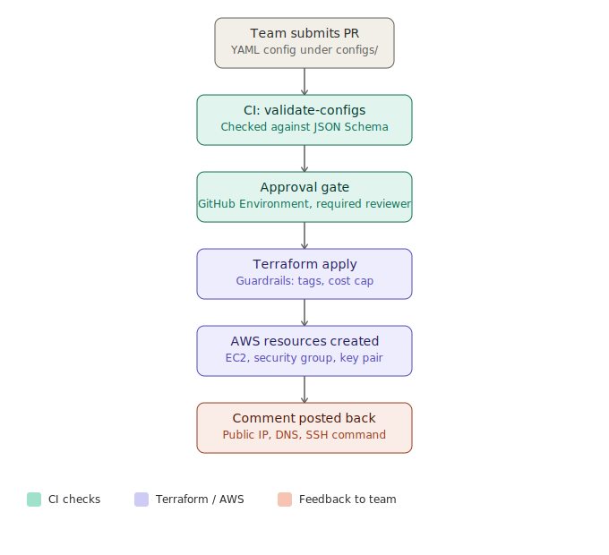

# Internal Developer Platform (IDP)

A self-service platform that lets engineering teams provision cloud infrastructure through a PR-based workflow, with no manual AWS console work and no waiting on a platform team.

Engineers request an environment by submitting a PR with a YAML config file.CI validatethe request a schema, Terraform provisions theinfrastructure, and the requesting team gets the live access details posted back automatically, all gated behind built-in guardrails.

Status: Core platform complete and fully working end to end.

## Architecture

## How it works

1. A team submits a pull request adding or modifying a YAML config file under `configs/`, specifying team, environment, resource type, size, cost cap, and required tags.
2. GitHub Actions validates the config against a JSON Schema before anything touches real infrastructure.
3. On merge to main, a second CI job runs Terraform against the validated configuration, gated behind a required manual approval for production changes.
4. Terraform provisions the infrastructure (EC2 instance, security group, key pair) with enforced tagging and a cost cap guardrail backed by a real AWS Budget.
5. Once provisioning succeeds, the instance's public IP, DNS, and SSH command are posted back automatically as a comment on the triggering commit.

## Guardrails

- Tag enforcement via a Terraform postcondition check, blocking any apply missing required tags
- Cost cap enforcement via AWS Budgets with alerts at 80 percent and 100 percent of the configured limit
- Production approval gate via a GitHub Environment with required reviewers before any apply runs

## Tech stack

- Terraform (infrastructure as code, remote state in S3 with DynamoDB locking)
- GitHub Actions (CI validation, gated deployment)
- AWS (EC2, IAM, Budgets, S3, DynamoDB)
- JSON Schema (config validation)
- Python (check-jsonschema for CI validation)

## Real incident response

This project includes a deliberately caused and fully documented production-style incident, not a hypothetical one. See the full postmortem: [Disk space exhaustion incident](docs/postmortems/2026-07-22-disk-full-incident.md)

A running log of real issues hit during development, root causes, and fixes is kept here: [Debugging log](docs/debugging-log.md)

## Repository structure

- `terraform/` - infrastructure as code (provider config, resources, variables, outputs)
- `configs/` - environment request YAML files submitted by teams
- `schemas/` - JSON Schema definitions used to validate config submissions
- `.github/workflows/` - CI pipelines for validation and gated deployment
- `docs/` - runbooks, debugging log, and postmortems
- `scripts/` - helper scripts

## Getting started

This repo is a working reference implementation rather than a install-and-run tool, since it provisions real AWS infrastructure tied to a specific account and backend. To adapt it:

1. Fork the repo
2. Create your own S3 bucket and DynamoDB table for Terraform state, and update the backend configuration in `terraform/main.tf`
3. Set the required GitHub Secrets: `AWS_ACCESS_KEY_ID`, `AWS_SECRET_ACCESS_KEY`, `SSH_PUBLIC_KEY`
4. Create a GitHub Environment named `production` with required reviewers
5. Submit a config under `configs/` matching the schema in `schemas/environment-request.schema.json`

## Project board
Ticket-by-ticket build progress, from initial AWS/IAM setup through CI, Terraform, guardrails, incident response, and documentation, is tracked on the [GitHub Projects board](https://github.com/users/smrash-dev-101/projects/1) for this repo.

## License

MIT
